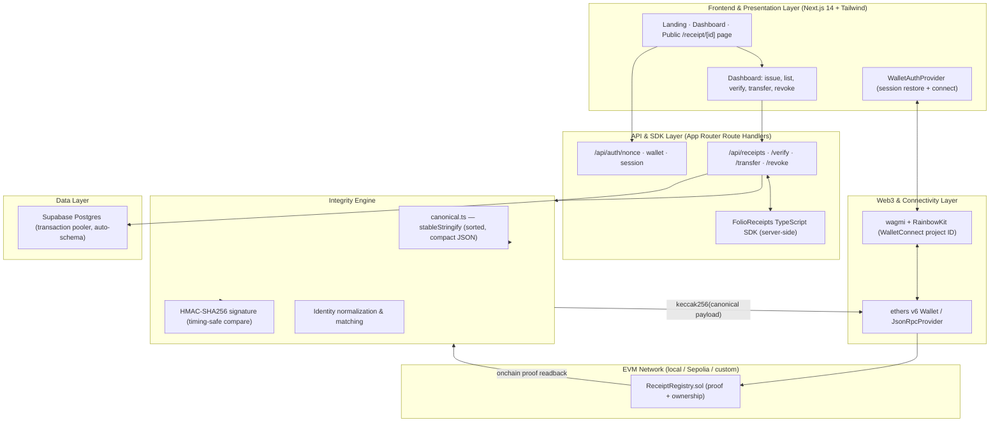

# Folio — Portable Receipt Layer for Digital Commerce

**Network:** Any EVM network the issuer deploys to (local Hardhat, Sepolia, or a custom `pharos` RPC network)
**Web3 Wallet Stack:** wagmi + RainbowKit (`@rainbow-me/rainbowkit`, `@tanstack/react-query`, `viem`) with WalletConnect project ID
**Smart Contract Framework:** Solidity 0.8.24 / Hardhat / ethers v6
**Frontend Architecture:** Next.js 14 (App Router) + TypeScript + Tailwind CSS
**Storage:** Supabase Postgres via `pg` (transaction pooler)

---

## 1. Executive Summary

Avox-style TCGs mint static cards with fixed attributes. Folio takes the opposite approach for commerce: **a receipt is a living, verifiable document whose integrity is enforced at every mutation** — product, buyer, seller, purchase date, payment reference, transfer history, rights and warranty — wrapped in a tamper-evident signature and optionally anchored on-chain.

In traditional e-commerce, a "receipt" is a blob your vendor controls; there is no portable way to prove purchase, ownership, or rights to a third party. Folio fixes that with three synchronized guarantees:

- **Signed portability** — every receipt carries an **HMAC-SHA256 signature** over a deterministic canonical JSON payload. The signature is stable regardless of object key order, so the same receipt verifies byte-for-byte across languages, systems and re-serialisations.
- **Ownership & provenance** — receipts can move between buyers. Each transfer appends a **signed history entry**, and ownership is checked against **normalized identities** (checksummed, case-folded wallets or human-readable ids) so a wallet always matches regardless of casing.
- **On-chain verifiability** — each receipt is optionally anchored in a **`ReceiptRegistry.sol`** contract that stores the receipt's hash, issuer, owner, issued-at time and revocation flag. The registry is the canonical on-chain source of truth; the full receipt stays off-chain and portable.

Every asset in the Folio ecosystem is verifiable:

- Receipts are **signed on issue** and re-signed on every transfer/revoke, keeping the provenance chain intact. (Receipt registry — like an ERC-721 collection — tracks ownership and transfer/revocation on-chain.)
- **Transfer** and **revoke** are atomic, permission-checked operations that mirror the registry's `Only owner` / `Only issuer` / `Only admin` rules.
- Verification compares the **off-chain signature** and the **on-chain anchor hash** together — tamper with the payload, break the signature; rewrite the payload, break the on-chain match.

---

## 2. High-Level Architecture

Folio is composed of six synchronized layers:



Data flows in one loop: the **dashboard** or **SDK** issues a receipt → the **Integrity Engine** canonicalises and signs it → the receipt is stored in **Postgres** and (when configured) anchored in **ReceiptRegistry** → **verification** re-derives the signature and compares the on-chain hash → the **public `/receipt/[id]` page** renders the verified payload and its verification status.

---

## 3. Smart Contract System & On-Chain Deployments

A single purpose-built contract is deployed and verified on the target network. It is deliberately minimal: the full receipt lives off-chain, and the registry stores only the **non-reversible hash** so it cannot be rewritten or repudiated.

### ReceiptRegistry.sol (proof & ownership layer)

```solidity
// SPDX-License-Identifier: MIT
pragma solidity ^0.8.24;

contract ReceiptRegistry {
    struct ReceiptProof {
        bytes32 receiptHash;
        address issuer;
        address owner;
        uint64  issuedAt;
        bool    exists;
        bool    revoked;
    }

    mapping(bytes32 => ReceiptProof) private receipts;
    mapping(address => bool) public issuers;
    address public admin;
}
```

### Storage structure

| Field | Meaning |
| --- | --- |
| `receiptHash` | `keccak256(canonical signed receipt payload)` — the tamper anchor |
| `issuer` | The whitelisted business that anchored the receipt |
| `owner` | Current owner per the chain (`onlyOwner` gates transfers) |
| `issuedAt` | `block.timestamp` at issue |
| `exists` | Whether the receipt id was ever anchored |
| `revoked` | Revocation flag; a revoked receipt cannot be transferred |

### Access control

- `mintCard`-equivalent → **`issue(bytes32 receiptId, bytes32 receiptHash, address owner)`** is restricted to whitelisted issuers via the `onlyIssuer` modifier.
- **`setIssuer(address, bool)`** lets the deployer (admin) grant/revoke issuer status (`onlyAdmin`).
- `transfer` is gated by `onlyOwner` **and** rejects revoked receipts.
- `revoke` accepts the **current owner, the issuing business, or the admin**.

### Core functions & events

| Function | Signature | Access | Purpose |
| --- | --- | --- | --- |
| `issue` | `(bytes32 receiptId, bytes32 receiptHash, address owner)` | `onlyIssuer` | Anchor a newly issued receipt; rejects duplicates |
| `transfer` | `(bytes32 receiptId, address to)` | `onlyOwner` | Move on-chain ownership; blocks revoked receipts |
| `revoke` | `(bytes32 receiptId)` | owner / issuer / admin | Set the revoked flag |
| `get` | `(bytes32 receiptId) view returns (ReceiptProof)` | public | Read the on-chain proof |

```solidity
event ReceiptIssued(bytes32 indexed receiptId, bytes32 indexed receiptHash, address indexed owner, address issuer);
event ReceiptTransferred(bytes32 indexed receiptId, address indexed from, address indexed to);
event ReceiptRevoked(bytes32 indexed receiptId, address indexed by);
event IssuerUpdated(address indexed issuer, bool allowed);
```

### On-chain wiring (scripts/deploy.ts)

- **`npm run deploy`** — default in-process Hardhat network; prints the registry address.
- **`npm run deploy:pharos`** — against `PHAROS_RPC_URL` (custom `pharos` network).
- **`npm run deploy:sepolia`** — public Sepolia testnet (chainId 11155111).
- The deployer becomes `admin`; the deployer address (or `PHAROS_ISSUER_ADDRESS`) is set as the initial whitelisted issuer.

**Optional activation.** Anchoring engages only when all three are set — `PHAROS_RPC_URL`, `PHAROS_RECEIPT_REGISTRY_ADDRESS`, `PHAROS_ISSUER_PRIVATE_KEY` (`isOnchainConfigured()`). When unset, everything works fully off-chain and `onchain.configured: false` is reported by verification.

---

## 4. Signature & Integrity Engine

The core differentiator is deterministic, language-agnostic signing.

### Canonical serialization (`src/lib/canonical.ts`)

`stableStringify` produces byte-identical JSON for structurally identical receipts:

- Object keys are **sorted recursively**.
- No whitespace.
- `undefined` properties are dropped (matching JSON semantics), so a store→parse round-trip never changes the canonical bytes.

### Signature scheme

```
signature = HMAC-SHA256(PHAROS_RECEIPT_SECRET, stableStringify(unsignedReceipt))
```

- The `proof` field itself is **excluded** from the signed payload and recomputed after every mutation.
- Comparisons use `crypto.timingSafeEqual` to avoid timing attacks.
- A **legacy canonicalisation** path keeps historical receipts (signed before deterministic serialization existed) validating.

### Secret handling

Secrets have **no fallback in production**. `env()` in `src/lib/env.ts` throws when a required value is missing, so the app fails loudly instead of shipping with a public default key. The signing secret must never rotate after launch, or existing signatures stop validating.

### Identity normalization

Buyer/owner identities may be a human-readable id (`alice@example.com`, `acme#20435`) or a wallet (`0x…`). `normalizeIdentity` checksums and case-folds wallets and lowercases human ids, so ownership checks match regardless of casing (`identitiesMatch`). This is the receipt-world equivalent of "stat modifier clamping": the same identity, however presented, always resolves to the same canonical form.

---

## 5. Receipt Lifecycle & Ownership Engine

The receipt is a **versioned document** (`version: "1.0"`) with a defined mutation lifecycle designed to stay fast and auditable.

### Receipt shape

```ts
type Receipt = {
  id: string;                     // "rcpt_<uuid>"
  version: "1.0";
  product: { name; description?; sku?; metadataUrl? };
  buyer: { id; wallet?; email? };
  seller: { id; name; website? };
  purchasedAt: string;            // ISO 8601
  payment: { amount; currency; reference; transactionHash?; chainId? };
  ownership: { status: "owned" | "transferred" | "revoked";
               currentOwner; transferable; revokedAt?; revocationReason? };
  transfers: { id; from; to; at; reference? }[];
  rights: { name; description?; expiresAt? }[];
  warranty?: { provider; expiresAt?; supportUrl? };
  proof: { algorithm: "HMAC-SHA256"; signature; issuedAt; onchain?: { txHash } };
};
```

### Issue

1. `assertIssuePayload` validates the required fields.
2. Ownership defaults to the buyer (`currentOwner = buyer.id` unless overridden).
3. The unsigned payload is canonicalised and signed, then persisted via an `INSERT … ON CONFLICT (id) DO UPDATE`.
4. When anchoring is configured, `ReceiptRegistry.issue` records `keccak256(receipt)` keyed by the receipt id; the returned `txHash` is stored back into Postgres and surfaced as `proof.onchain`.

### Mutation rules (transfer & revoke)

| Operation | Guards |
| --- | --- |
| **Transfer** | destination must be non-empty · receipt must be `transferable` · must not be `revoked` · caller must be current owner or the issuing business |
| **Revoke** | must not already be revoked · caller must be owner or issuing business |

Every mutation rebuilds the payload, **appends the history entry**, re-signs, and (when configured) anchors the chain write — so the provenance chain stays cryptographically intact and verification re-derives the new signature rather than trusting the stored one.

---

## 6. Verification & Proof Model

Verification is the product. Anyone — a buyer, a warranty desk, a future seller — can independently check a receipt in two layers that must **both** hold:

### Layer 1 — Off-chain signature

`verifyReceipt` recomputes `signObject(unsigned)` (canonical + legacy) and compares timing-safely against the stored signature. A mismatch means the stored payload was tampered with.

### Layer 2 — On-chain anchor

When anchoring is configured, the registry's `get(receiptIdToBytes32(id))` proof must satisfy:

```
exists === true  AND  receiptHash === keccak256(canonical payload)  AND  no read error
```

The on-chain record also returns `owner`, `issuer`, `issuedAt`, `revoked`, `chainId` and `registry` address for the UI.

### API surface

```json
GET /api/receipts/:id/verify
{ "valid": true, "receipt": { … }, "onchain": { "configured": true, "exists": true,
  "matchesHash": true, "owner": "0x…", "registry": "0x…", "chainId": 11155111, "txHash": "0x…" } }
```

A failed check returns `{ "valid": false, "reason": "…" }` with HTTP 404. The public **`/receipt/[id]`** page renders the signed payload, its `owned / transferred / revoked` status, purchase/ownership panels, rights & warranty, transfer history, and a live **verification status** block.

---

## 7. Transfer & Revocation Mechanics

Secondary "trading" here is the movement of ownership — the receipt-ground truth when a product is resold, gifted, or reclaimed.

### Transfer settlement (seller → buyer)

1. The caller provides a destination identity (`to`) and an optional `reference` ("gift", order id…).
2. Guards pass (see §5), a `transfer` record `{ id: tr_<uuid>, from, to, at, reference }` is appended and ownership flips to `transferred`.
3. The payload is re-signed and persisted; `ReceiptRegistry.transfer` mirrors `from → to` on-chain so the chain of custody is provable.
4. Both the old and new owner's dashboards now list the receipt under the right identity.

### Revocation (refund / chargeback / cancelled access)

- The owner, the issuing business, or the admin may revoke (`revokeReceipt`) with an optional reason, recording `revokedAt` + `revocationReason`.
- A revoked receipt **cannot be transferred** — enforced both off-chain (`transferReceipt` guard) and on-chain (`require(!receipt.revoked, …)`).
- `ReceiptRegistry.revoke` writes the flag; verification reflects the revoked statuses.

---

## 8. Web3 Connectivity & Session Auth

### Wallet stack

- **wagmi + RainbowKit** (`WagmiProvider` → `QueryClientProvider` → `RainbowKitProvider` → `WalletAuthProvider`) in `src/app/providers.tsx`.
- **Multi-chain aware** config (`chains: [mainnet, sepolia]`) so an incoming wallet already on any network never throws a chain-configuration error.
- **`NEXT_PUBLIC_WALLETCONNECT_PROJECT_ID`** enables WalletConnect deep-links / QR so mobile browsers can connect; injected providers work without it.

### Sign-in flow (SIWE-style, non-custodial)

1. `GET /api/auth/nonce` — server issues a random nonce stored in an `httpOnly` cookie (`pharos_nonce`, 5 min).
2. The wallet signs the exact EIP-191 message: `Sign in to Folio\nNonce: ${nonce}`.
3. `POST /api/auth/wallet` — the server **re-recovers** the signer via `ethers.verifyMessage`, checks it matches the claimed `address`, and on success sets a signed `pharos_session` cookie.

### Session cookie

- 7-day lifetime, `httpOnly`, `SameSite=Lax`, `Secure` in production.
- Value is `wallet.issuedAt` + an HMAC-SHA256 tag (`signSession`), and is **verified** (including a 7-day expiry check) on every authenticated request — so sessions cannot be forged.
- `GET /api/auth/session` restores the wallet client-side on reload; `DELETE` clears it.

### Multi-network behavior

Every on-chain operation is gated behind `isOnchainConfigured()` and reads the registry through a fresh `JsonRpcProvider` at `PHAROS_RPC_URL`, degrading gracefully to fully off-chain mode when unset — the frontend's `onchain.configured` flag tells consumers which mode is live.

### Browsing security

- **Business API key** (`x-api-key` = `PHAROS_API_KEY`) authorizes server-to-server issuing, transfers and revocations.
- **Registry sync**: the dashboard's `WalletAuthProvider` re-restores the session and the connect button exposes dashboard / disconnect actions, so authenticated users interact only with receipts that match their normalized identity.

---

## 9. Developer Guide & Local Setup

### Prerequisites

- **Node.js v22+** (repo engine requirement)
- **Package manager:** npm
- **Postgres** (Supabase, or any Postgres — the app creates tables automatically)
- **Web3 wallet** (MetaMask / Coinbase Wallet / Rabby) for the wallet-connected dashboard

### Installation

```bash
git clone https://github.com/Ezekiel544/Folio.git
cd folio
npm install
cp .env.example .env
```

### Environment (`.env` / `.env.example`)

| Variable | Required | Purpose |
| --- | --- | --- |
| `PHAROS_API_KEY` | yes | Business API key (`x-api-key`) for issuing/transferring/revoking |
| `PHAROS_RECEIPT_SECRET` | yes | HMAC key signing every receipt — never rotate after launch |
| `PHAROS_SESSION_SECRET` | yes | Signs the wallet session cookie |
| `DATABASE_URL` | yes | Supabase Postgres **transaction pooler** URL |
| `NEXT_PUBLIC_WALLETCONNECT_PROJECT_ID` | for mobile | Free WalletConnect Cloud project ID |
| `PHAROS_ALLOW_CLIENT_ISSUE` | no | Demo-only; leave false in production |
| `PHAROS_RPC_URL` | on-chain only | RPC the app anchors through |
| `PHAROS_ISSUER_PRIVATE_KEY` | on-chain only | Hot wallet that writes anchors |
| `PHAROS_RECEIPT_REGISTRY_ADDRESS` | on-chain only | Deployed `ReceiptRegistry` |
| `PHAROS_DB_TABLE` | no | Table name; defaults to `receipts` (tests use `receipts_test`) |

> In a Vercel deployment there is **no fallback** for the four required values — the app throws rather than using a public default.

### Run & verify

```bash
npm run dev        # http://localhost:3000
npm run build      # TypeScript + production build
npx tsc --noEmit   # type verification
```

### Test suite

```bash
npm run test:contract   # Hardhat — ReceiptRegistry behaviour (admin, issuer, transfer, revoke)
npm run test:lib        # node --test — 19 lib cases: signing, canonicalization, transfer/revoke rules,
                        #   identity casing, session sidecar (isolated receipts_test table)
npm test                # both
```

### Server-side SDK

```ts
import { FolioReceipts } from "./src/lib/folio-receipts-sdk";

const folio = new FolioReceipts(process.env.PHAROS_BASE_URL!, process.env.PHAROS_API_KEY!);

const { receipt } = await folio.issue({
  product: { name: "Creator Pass", sku: "CP-2026" },
  buyer: { id: "alex@example.com", wallet: "0xAbC…" },
  seller: { id: "studio", name: "Studio Inc." },
  purchasedAt: new Date().toISOString(),
  payment: { amount: 49, currency: "USD", reference: "order_123" },
  rights: [{ name: "Lifetime access" }],
  warranty: { provider: "support@studio.com" },
});

const { valid, reason } = await folio.verify(receipt.id);
await folio.transfer(receipt.id, "0x0d…", "gift");
await folio.revoke(receipt.id, "chargeback");
```

### Deploying the registry

```bash
# Provide PHAROS_ISSUER_PRIVATE_KEY in .env, then:
npm run deploy            # local Hardhat
npm run deploy:sepolia    # public Sepolia (fund the issuer wallet first)
npm run deploy:pharos     # custom network via PHAROS_RPC_URL
```

The script prints `PHAROS_RECEIPT_REGISTRY_ADDRESS` and `PHAROS_ISSUER_ADDRESS`; wire them into `.env` / Vercel env vars to enable on-chain anchoring. Leaving them unset runs everything off-chain.

---

## 10. Deployment & Security Model

### Deployment (Vercel + Supabase)

- **Database:** Supabase project → copy the **Transaction pooler** connection string (port `6543`) into `DATABASE_URL`. Tables and indexes are created automatically on first use — no SQL to run.
- **App:** import the repo into Vercel (Next.js preset) and set the env vars above. No persistent disk or build steps are required.
- **Backups:** `pg_dump "$DATABASE_URL" > folio-$(date +%F).sql` — store `PHAROS_RECEIPT_SECRET` alongside, since without the signing key the DB cannot validate its own receipts.

### Security properties

- **Constant-time comparisons** for signatures and session tokens (`timingSafeEqual`).
- **`httpOnly` + `SameSite=Lax` + `Secure` cookies** for nonce and session.
- **Same-origin guard** (`assertSameOrigin`) blocks CSRF on browser-initiated writes; API-key calls (no Origin header) are unaffected.
- **Per-IP sliding-window rate limiting** on every route (`assertRateLimit`).
- **Secret hygiene** — no defaults in production, `.env` is gitignored, and wallet signatures are verified by key recovery rather than trusting client claims.
- **Defense in depth for verification** — off-chain signature and on-chain anchor must both pass; a modified stored payload breaks the signature, a rewritten on-chain record breaks the hash match.

---

*Folio turns every purchase into a portable, signed receipt — proof of purchase, ownership, transfers, rights and warranty — verifiable anywhere, with or without a chain lookup.*